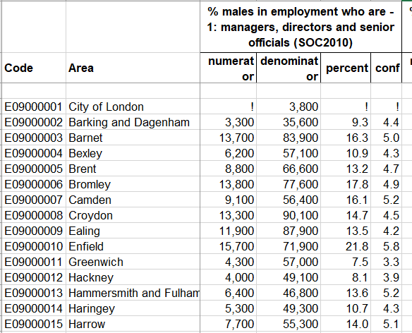
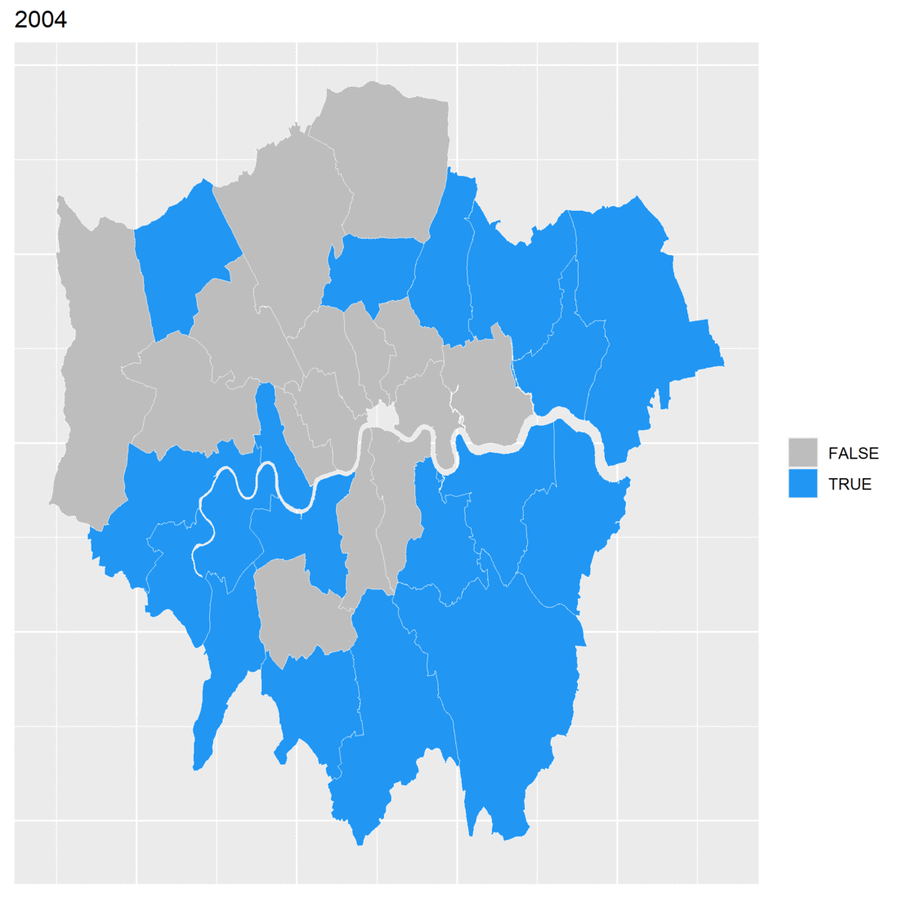

```{r setup, include=FALSE}
knitr::opts_chunk$set(echo = FALSE)
```

```{r, include=FALSE}
library(tidyverse)
library(stringr)
library(cluster)
library(proxy)
library(mapproj)
library(multipanelfigure)
library(knitr)
library(readxl)
library(plyr)
library(dplyr)
library(gganimate)
library(ggplot2)
library("ggpubr")
library(maps)
library(DT)
library(geojsonio)
library(broom)
```


```{r, include=FALSE}
sectors <- c("Area", "M1", 'M2', 'M3', 'M4', 'M5', 'M6', 'M7', 'M8', 'M9', 'F1','F2','F3','F4','F5','F6','F7',"F8","F9")
i <- c("M1", 'M2', 'M3', 'M4', 'M5', 'M6', 'M7', 'M8', 'M9', 'F1','F2','F3','F4','F5','F6','F7',"F8","F9")
years <- 2004:2019

df_suffix <- 2004

for (sheet_val in c(4:19)) {
  df <- readxl::read_xlsx('employment-by-occ-and-gender.xlsx', sheet = sheet_val, skip = 1)

  df <- df %>% select(Area, contains("numerator"))

  colnames(df) <- as.character(sectors)
  df <- na_if(df, "!")
  df[ , i] <- apply(df[ , i], 2, function(x) as.numeric(as.character(x)))
  df <- df[3:34,]
  df$Year = df_suffix
  assign(paste("df", df_suffix, sep = "_"), df)
  df_suffix <- df_suffix + 1
}

listofDF <- list(df_2004, df_2005, df_2006, df_2007, df_2008, df_2009, df_2010, df_2011, 
             df_2012, df_2013, df_2014, df_2015, df_2016, df_2017, df_2018, df_2019)
listofDF <- lapply(listofDF, function(df) {
  na_if(df, "!")})
dataset1 <- bind_rows(listofDF)
dataset1 <- filter(dataset1, Year!=2014)
dataset1[is.na(dataset1)] <- 0

total <- read_excel('employment-rates-region-quarters-since1992xlsx.xlsx', 2, skip =  1) %>% select(Quarter, contains("%"))

male <- read_excel('employment-rates-region-quarters-since1992xlsx.xlsx', 3, skip =  1) %>% select(Quarter, contains("%"))

female <- read_excel('employment-rates-region-quarters-since1992xlsx.xlsx', 4, skip =  1) %>% select(Quarter, contains("%"))

## Renaming Column Names
areas <- c("Quarter", 'North_East', 'North_West', 'Yorkshire_and_The_Humber',	'East_Midlands', 'West_Midlands', 'East', 'London', 'South_East', 'South_West', 'Wales', 'Scotland', 'Northern_Ireland', 'England', 'England_and_Wales', 'UK', 'UK_Excluding_London')
colnames(total) <- as.character(areas)
colnames(male) <- as.character(areas)
colnames(female) <- as.character(areas)

## Selecting data from 2000-now
total <- tail(total, -92)
male <- tail(male, -92)
female <- tail(female, -92)

## Create clear quarters
total <- total[grepl("Jan-Mar", total[["Quarter"]]) | grepl("Apr-Jun", total[["Quarter"]]) | grepl("Jul-Sep", total[["Quarter"]]) | grepl("Oct-Dec", total[["Quarter"]]) , ]
total <- separate(total, "Quarter", c("Quarter", "Year"), sep = " ")

male <- male[grepl("Jan-Mar", male[["Quarter"]]) | grepl("Apr-Jun", male[["Quarter"]]) | grepl("Jul-Sep", male[["Quarter"]]) | grepl("Oct-Dec", male[["Quarter"]]) , ]
male <- separate(male, "Quarter", c("Quarter", "Year"), sep = " ")


female <- female[grepl("Jan-Mar", female[["Quarter"]]) | grepl("Apr-Jun", female[["Quarter"]]) | grepl("Jul-Sep", female[["Quarter"]]) | grepl("Oct-Dec", female[["Quarter"]]) , ]
female <- separate(female, "Quarter", c("Quarter", "Year"), sep = " ")

```


## Introduction

This report details findings of an analysis of employment in London between 2004-2019. This data is publicly available from the Annual Population Survey, produced by the Office for National Statistics, obtained via the [City of London's](https://data.london.gov.uk/dataset/employment-occupation-type-and-gender-borough) website. We were able to analyze trends in types of employment, employment status, and employment growth. 

This project was of interest because London is a large international community that provides a snapshot into the economic situation of the world. Employment is a good indicator of social and economic success and independence that allows us to quantitatively understand how the role of women have changed. Furthermore, because London is such a primary node in the global economic network, it should be impacted by major global events such as the Syrian Refugee Crisis beginning in Fall 2017, the Globabl Financial Crisis (GFC) of 2007-2008, and the departure of United Kingdom from the EU "Brexit" which was announced in March 2017.

Upon considering the data available, the following questions are viable:

1. What occupations are dominated by women and which are dominated by men? How have these ratios changed over time?
2. Which parts of London have the most equal ratios of employment based on gender? The least? How do these employment ratios reflect the overall employment rate for each borough? How does ratio of employment based on gender change depending on the occupation groups with the most employees in each borough (do more male dominated occupation groups mean less women are employed)?
3. Which occupations are growing in London overall? Which are shrinking?
4. Overall, how have employment rates changed in London, and has the beginning of 2020 been different, likely as a result of COVID-19? How has the  crisis and its affect of child care affected female employment in London?
5. How have international events impacted London's workforce?


## Data Description and Exploration

We used two datasets in this analysis. The first one contains the employment rates broken down by major occupation group and gender during 2004 to 2019. This dataset was split into multiple sheets by year and for each year untidy data was recorded. Here is an example of what the dataset excel spreadsheet looks like:



Here you can see that the data is divided by male and female and occupation group. This means that there are 18 big columns with 4 smaller columns each. Furthermore, the dataset also contains data for other parts of the UK. By only taking the smaller numerator column for each of the 18 big columns, there are a total of 18 variables recorded for each burough (of which there are 32), for each year between 2004-2019. 
There are 9 major occupation groups that this dataset is grouped into: 

1. managers and senior officials
2. professional occupations
3. associate prof & tech occupations
4. administrative and secretarial occupations
5. skilled trades occupations
6. personal service occupations
7. sales and customer service occupations
8. process, plant and machine operatives
9. elementary occupations

To prepare this data for the analytical methods below, we had to alter the variables to a more compact name such as M1, M2, F1, F2, etc with M or F denoting gender and 1-9 denoting occupation group. We selected only the smaller numerator columns to be the values for each of the 18 variables and removed the data recorded for areas outside of London and its boroughs and changed the values listed as "!" to NA. We did this for each year individually since they were split onto different tabs in the excel spreadsheet. Then, we had to combine all of the dataframes created and add another variable which we called Year. Throgh further analysis, we discovered that some data in 2014 was incorrectly inputed since there were decimal values in the numerator even though the dataset says that the numerator was rounded to the nearest whole number, so we had to discard all the data from 2014. Here is an example of what the tidied dataset looks like:

Employment in London by Gender and Borough

```{r, echo = FALSE}
kable(dataset1[c(2,3,4,34,35,36),])

occupation_codes <- tibble(Code = c("1", "2", "3", "4", "5", "6", "7", "8", "9"), Occupation = c("managers, directors and senior officials", "professional occupations", "associate prof & tech occupations", "administrative and secretarial occupations", "skilled trades occupations", "caring, leisure and other service occupations", "sales and customer service occupations", "process, plant and machine operatives", "elementary occupations"))
```

```{r, echo =FALSE, warning=FALSE}
 dataset1 %>% mutate(male = M1 + M2 + M3 + M4 + M5 + M6 + M7 + M8 + M9,
                     female = F1 + F2 + F3 + F4 + F5 + F6 + F7 + F8 + F9) %>%
                 select(Area, male, female, Year) %>% group_by(Year) %>% summarise_all(mean) %>%
        pivot_longer(contains("male"), names_to = "gender", values_to = "n") %>% select(-Area) %>%
  ggplot( aes(x=Year, y=n, group=gender, color=gender)) +
    geom_line() +
    geom_point() +
    ggtitle("Employment by gender") +
    ylab("Number of employees") +
    scale_x_continuous(breaks=seq(2004,2019,1)) +
  theme(axis.text.x = element_text(angle = 45))
```

In cleaning up this dataset, we created three separate dataframes corresponding to the three datasets: one for total employment rates, one for female employment rates, and one for male employment rates. Each one of these datasets included a span of months of a year in one column, as well as names of each region of the UK, the total number of people employed within that region, the total number of people in that region, and the employment rate percentage in that region. In order to clean this up, we separated out the quarter and the year, as we were mainly concerned with the average employment rates for an individual year, rather than an individual quarter. 

We then got rid of all columns regarding the number of people and specifically focused on the percentages given. This was done for all three dataframes until the data was sufficiently cleaned. The challenge of this cleanup was definitely separating the dataframes up and figuring out how to get the columns formatted in a useful way. To do this, we skipped the first row in each dataset, and selected for anything that contained a “%” for each of the three datasets to get specifically the percentages. Then we created column names which were each of the regions of the UK that were originally in the dataset. This concluded our cleaning of the columns. Next we were only concerned with the data from 2000 to present, so we got rid of any rows/years that did not fit in that category. The final problem to tackle in this cleanup was to understand the quarters better, as the way the months ranged had many overlaps, and each year was divided up in many separate “quarters” of a year, instead of four generic ones. Therefore, we got rid of any rows that did not correspond to a set quarter (Jan-Mar, Apr-Jun, Jul-Sep, Oct-Dec). 


## Results

This section contains the methods and results obtained for the questions stated above.

### Question 1
*__What occupations are dominated by women and which are dominated by men? How have these ratios changed over time?__*

We approached this question first by determining the which occupations primarily are held by women over all of the years in the dataset except for 2014. The following bar graph displays the average gender ratio for each occupation.

```{r, echo=FALSE}

occbygender <- dataset1 %>% 
               group_by(Year) %>%
               select(-Area) %>%
               summarise_all(sum) %>%
               pivot_longer(-Year, names_to = "occupation", values_to = "n") %>% 
               mutate(gender = ifelse(startsWith(occupation, "M"), "Male", "Female"),
                      occupation = str_sub(occupation,2))
```


```{r, echo = FALSE}
group_by(occbygender, occupation, gender) %>% summarize_if(is.numeric, mean) %>%
  ggplot(aes(x=occupation, y=n, fill=gender)) + theme_minimal() +
  geom_bar(stat="identity", position = "fill") +
  labs(x = "Occupation Code", y = "Percentage", title = "Occupation by Gender based on Average") +
  geom_hline(yintercept = 0.5, color = "red")

kable(occupation_codes)
```

From this graph, we can see that, on average. there are 3 occupations which are female dominated. The occupation codes are 4, 6, and 7 which correlate with administrative and secretarial occupations, caring, leisure and other service occupations, and sales and customer service occupations. The fact that all three of these occupations are primarily held by women did not surprise us. We looked further into this by making a bar graph for each occupation to see how the gender ratio changed over time. 

```{r, include=FALSE}
one <- filter(occbygender, occupation == "1") %>% ggplot(aes(x = Year, y = n, fill = gender)) + theme_minimal() +
  geom_bar(stat="identity", position = "fill") +
  labs(x = "Year", y = "Percentage", title = "Occupation 1 ") +
  geom_hline(yintercept = 0.5, color = "red")
two <- filter(occbygender, occupation == "2") %>% ggplot(aes(x = Year, y = n, fill = gender)) + theme_minimal() +
  geom_bar(stat="identity", position = "fill") +
  labs(x = "Year", y = "Percentage", title = "Occupation 2 ") +
  geom_hline(yintercept = 0.5, color = "red")
three <- filter(occbygender, occupation == "3") %>% ggplot(aes(x = Year, y = n, fill = gender)) + theme_minimal() +
  geom_bar(stat="identity", position = "fill") +
  labs(x = "Year", y = "Percentage", title = "Occupation 3 ") +
  geom_hline(yintercept = 0.5, color = "red")
four  <- filter(occbygender, occupation == "4") %>% ggplot(aes(x = Year, y = n, fill = gender)) + theme_minimal() +
  geom_bar(stat="identity", position = "fill") +
  labs(x = "Year", y = "Percentage", title = "Occupation 4 ") +
  geom_hline(yintercept = 0.5, color = "red")
five  <- filter(occbygender, occupation == "5") %>% ggplot(aes(x = Year, y = n, fill = gender)) + theme_minimal() +
  geom_bar(stat="identity", position = "fill") +
  labs(x = "Year", y = "Percentage", title = "Occupation 5 ") +
  geom_hline(yintercept = 0.5, color = "red")
six <- filter(occbygender, occupation == "6") %>% ggplot(aes(x = Year, y = n, fill = gender)) + theme_minimal() +
  geom_bar(stat="identity", position = "fill") +
  labs(x = "Year", y = "Percentage", title = "Occupation 6 ") +
  geom_hline(yintercept = 0.5, color = "red")
seven <- filter(occbygender, occupation == "7") %>% ggplot(aes(x = Year, y = n, fill = gender)) + theme_minimal() +
  geom_bar(stat="identity", position = "fill") +
  labs(x = "Year", y = "Percentage", title = "Occupation 7 ") +
  geom_hline(yintercept = 0.5, color = "red")
eight <- filter(occbygender, occupation == "8") %>% ggplot(aes(x = Year, y = n, fill = gender)) + theme_minimal() +
  geom_bar(stat="identity", position = "fill") +
  labs(x = "Year", y = "Percentage", title = "Occupation 8 ") +
  geom_hline(yintercept = 0.5, color = "red")
nine <- filter(occbygender, occupation == "9") %>% ggplot(aes(x = Year, y = n, fill = gender)) + theme_minimal() +
  geom_bar(stat="identity", position = "fill") +
  labs(x = "Year", y = "Percentage", title = "Occupation 9 ") +
  geom_hline(yintercept = 0.5, color = "red")

```

```{r, echo = FALSE}
figure <- ggarrange(one, two, three, four, five, six, seven, eight, nine,
                   common.legend = TRUE, legend = "bottom", 
                   nrow = 1, ncol = 3)
figure[[1]]
figure[[2]]
figure[[3]]
```

Comparatively, when looking at the change in ratios between male and gender for each occupation over time, we can see that occupations 4,6, and 7 have remained majority female for a long period. We can also see that in 2019, occupation 9 became majority female. In order to look more into this, we created bar graphs for occupations 4, 6, 7, and 9 that are not proportioned.

```{r, include=FALSE}
one <- filter(occbygender, occupation == "1") %>% ggplot(aes(x = Year, y = n, fill = gender)) + theme_minimal() +
  geom_bar(stat="identity") +
  labs(x = "Year", y = "N", title = "Occupation 1 ") + 
  scale_y_continuous(labels = scales::comma)
two <- filter(occbygender, occupation == "2") %>% ggplot(aes(x = Year, y = n, fill = gender)) + theme_minimal() +
  geom_bar(stat="identity") +
  labs(x = "Year", y = "N", title = "Occupation 2 ") + 
  scale_y_continuous(labels = scales::comma)
three <- filter(occbygender, occupation == "3") %>% ggplot(aes(x = Year, y = n, fill = gender)) + theme_minimal() +
  geom_bar(stat="identity") +
  labs(x = "Year", y = "N", title = "Occupation 3 ") + 
  scale_y_continuous(labels = scales::comma)
  
four  <- filter(occbygender, occupation == "4") %>% ggplot(aes(x = Year, y = n, fill = gender)) + theme_minimal() +
  geom_bar(stat="identity") +
  labs(x = "Year", y = "N", title = "Occupation 4 ") + 
  scale_y_continuous(labels = scales::comma)
  
five  <- filter(occbygender, occupation == "5") %>% ggplot(aes(x = Year, y = n, fill = gender)) + theme_minimal() +
  geom_bar(stat="identity") +
  labs(x = "Year", y = "N", title = "Occupation 5 ") + 
  scale_y_continuous(labels = scales::comma)
  
six <- filter(occbygender, occupation == "6") %>% ggplot(aes(x = Year, y = n, fill = gender)) + theme_minimal() +
  geom_bar(stat="identity") +
  labs(x = "Year", y = "N", title = "Occupation 6 ") + 
  scale_y_continuous(labels = scales::comma)
  
seven <- filter(occbygender, occupation == "7") %>% ggplot(aes(x = Year, y = n, fill = gender)) + theme_minimal() +
  geom_bar(stat="identity") +
  labs(x = "Year", y = "N", title = "Occupation 7 ") + 
  scale_y_continuous(labels = scales::comma)
  
eight <- filter(occbygender, occupation == "8") %>% ggplot(aes(x = Year, y = n, fill = gender)) + theme_minimal() +
  geom_bar(stat="identity") +
  labs(x = "Year", y = "N", title = "Occupation 8 ") + 
  scale_y_continuous(labels = scales::comma)
  
nine <- filter(occbygender, occupation == "9") %>% ggplot(aes(x = Year, y = n, fill = gender)) + theme_minimal() +
  geom_bar(stat="identity") +
  labs(x = "Year", y = "N", title = "Occupation 9 ") + 
  scale_y_continuous(labels = scales::comma)
  

```


```{r}
filter(occbygender, occupation == "2") 
# ggplot(aes(x = Year, y = n, fill = gender)) + theme_minimal() +
#   geom_bar(stat="identity") +
#   labs(x = "Year", y = "N", title = "Occupation 2 ") + 
#   scale_y_continuous(labels = scales::comma)
```

```{r, echo = FALSE}
# figure <- ggarrange(one, two, three, four, five, six, seven, eight, nine,
#                    common.legend = TRUE, legend = "bottom", 
#                    nrow = 1, ncol = 3)
# figure[[1]]
# figure[[2]]
# figure[[3]]

figure <- ggarrange(four, six, seven, nine,
                   common.legend = TRUE, legend = "bottom", 
                   nrow = 1, ncol = 2)
figure[[1]]
figure[[2]]
two
```

Here we can see that every occupation group except four were increasing in number of total employees from 2004-2015, after which there is a decline.

In summary, there are three occupation groups that are female dominated.

### Question 2

*__Which parts of London have the most equal ratios of employment based on gender? The least? How do these employment ratios reflect the overall employment rate for each borough??__*

We first find the top 8 boroughs for highest and smallest percentage of female employees. 


```{r, include=FALSE}
occbyarea <- dataset1 %>% group_by(Area, Year) %>% summarise_if(is.numeric, sum)  %>% 
  mutate(male = M1 + M2 + M3 + M4 + M5 + M6 + M7 + M8 + M9, female = F1 + F2 + F3 + F4 + F5 + F6 + F7 + F8 + F9,
         one = M1 + F1, two = M2 + F2, three = M3 + F3, four = M4 + F4, five = M5 + F5,
         six = M6 + F6, seven = M7 + F7, eight = M8 + F8, nine = M9 + F9)
```

Here are two tables to show the findings.

Best 8 Boroughs with high female employee Percentages:
```{r, echo=FALSE}
avg <- occbyarea %>% select(Area, Year, male, female) %>% mutate(percentage = female / (male + female)) %>%
  select(Year, percentage, Area) %>% group_by(Area) %>%
  summarize_if(is.numeric, mean) %>% select(-Year) %>% arrange(desc(percentage))
  # ggplot(aes(x = Year, y = percentage, group = Area, colors = Area)) +
  #   geom_line() +
  #   ylab("Percentage of Female Employees") +
  #   scale_x_continuous(breaks=seq(2004,2019,1)) + theme(axis.text.x = element_text(angle = 45))
kable(head(avg, n = 8))

topboroughs <- head(avg, n = 8) %>% select(Area) %>% unlist
lowboroughs <- tail(avg, n = 8) %>% select(Area) %>% unlist
```

Worst 8 Boroughs with high female employee Percentages:
```{r, echo=FALSE}
kable(tail(avg, n = 8))
```


Here is a colored map of the findings above:


```{r}
## Choropleth map to show which regions in london have the largest gaps in employment rates between men and women
library(geojsonio)
library(broom)
library(ggplot2)
spdf <- geojson_read("https://skgrange.github.io/www/data/london_boroughs.json",  what = "sp")
spdf_fortified <- tidy(spdf)

ggplot() +
  geom_polygon(data = spdf_fortified, aes(x = long, y = lat, group = group), fill="white", color="black") + 
  theme_void() +
  coord_map()
```


__Boroughs with percent difference between male and female employees less than 0.1:__ 




```{r, echo=FALSE}
highper <-occbyarea %>% select(Area, Year, male, female) %>% mutate(percentage = female / (male + female)) %>%
  select(Year, percentage, Area) %>% group_by(Area) %>% subset(Area %in% topboroughs) %>%
  ggplot(aes(x = Year, y = percentage)) +
    geom_line(aes(color = Area)) +
    ylab("Percentage of Female Employees") +
    scale_x_continuous(breaks=seq(2004,2019,1)) + 
    theme(axis.text.x = element_text(angle = 45)) +
    ggtitle("Percent of Female Employees by Year")

highnum <- occbyarea %>% select(Area, Year, male, female) %>%
  select(Year, female, Area) %>% group_by(Area) %>% subset(Area %in% topboroughs) %>%
  ggplot(aes(x = Year, y = female)) +
    geom_line(aes(color = Area)) +
    ylab("Number of Female Employees") +
    scale_x_continuous(breaks=seq(2004,2019,1)) + 
    theme(axis.text.x = element_text(angle = 45)) +
    ggtitle("Number of Female Employees by Year")

lowper <- occbyarea %>% select(Area, Year, male, female) %>% mutate(percentage = female / (male + female)) %>%
  select(Year, percentage, Area) %>% group_by(Area) %>% subset(Area %in% topboroughs) %>%
  ggplot(aes(x = Year, y = percentage)) +
    geom_line(aes(color = Area)) +
    ylab("Percentage of Female Employees") +
    scale_x_continuous(breaks=seq(2004,2019,1)) + 
    theme(axis.text.x = element_text(angle = 45)) +
    ggtitle("Percent of Female Employees by Year")

lownum <- occbyarea %>% select(Area, Year, male, female) %>%
  select(Year, female, Area) %>% group_by(Area) %>% subset(Area %in% lowboroughs) %>%
  ggplot(aes(x = Year, y = female)) +
    geom_line(aes(color = Area)) +
    ylab("Number of Female Employees") +
    scale_x_continuous(breaks=seq(2004,2019,1)) + 
    theme(axis.text.x = element_text(angle = 45)) +
    ggtitle("Number of Female Employees by Year")
```

We attempted to look at the gender ratio for the top and worst boroughs over time. However, due to the miniscule ups and downs, the two figures below could not be analyzed as we had hoped.

```{r, echo=FALSE}
highper
lowper
```

We then decided to use the number of female employees for each of the above bouroughs instead.

```{r}
highnum
lownum
```

In the first graph, it is clear that the number of female employees has generally increased for all boroughs from 2004-2019. However, in the second graph there does not seem to be a huge difference from 2004 to 2019 except for Tower Hamlets, Newham and Brent. 


```{r, echo=FALSE}

top3 <- occbyarea %>% select(Area, one,two,three,four,five,six,seven,eight,nine) %>% group_by(Area) %>%
    summarize_if(is.numeric, mean) %>%
    mutate_if(is.numeric, ceiling)

placeholder <- data.frame(t(top3[-1]))
colnames(placeholder) <- top3[,1] %>% unlist
top3 <- placeholder
datatable(top3[,1:8])
datatable(top3[,9:16])
datatable(top3[,17:24])
datatable(top3[,25:32])
```

```{r, echo=FALSE}
Areas <- colnames(top3)
occ3 <- c("nine, two, four", "two, three, one", "two, four, three", "two, three, nine",
          "two, three, four", "two, three, one","two, three, four", "two, three, one",
          "two, three, four", "two, three, nine", "two, three, one", "two, three, one",
          "two, three, nine", "two, four, three", "two, four, three", "two, three, four",
          "two, three, one", "two, three, one", "three, two, one", "two, three, one",
          "two, three, one", "two, three, four", "two, three, one", "nine, two, three",
          "two, three, four", "two, three, one", "two, three, one", "two, three, four",
          "two, three, nine", "two, three, four", "two, three, one", "two, three, one")
kable(tibble(Area = Areas, "Top 3 Occupation Groups" = occ3))
```

From the table above, we discovered that the top 3 occupations of each borough was highly going to include both two and three.

Therefore, we decided to look more at the numbers instead of the percentages.

```{r, echo=FALSE}
occbyarea %>% select(Year, Area, female) %>% group_by(Area) %>% summarize_if(is.numeric, mean) %>% select(-Year) %>%
  arrange(desc(female)) %>% mutate(Num_females = female) %>% select(-female) %>%
  kable
```


### Question 3

__Which occupations are growing in London and is this due to more women being employed in these occupations? Which are shrinking?__

```{r, echo=FALSE}
sectorpercent <- occbyarea %>% group_by(Year) %>% summarise_if(is.numeric, sum)

sectorpercent %>% select(Year, one, two, three, four, five, six, seven, eight, nine) %>% 
  mutate(total = one + two + three + four + five + six + seven + eight + nine) %>%
  mutate(one = one / total,
         two = two / total,
         three = three / total,
         four = four / total,
         five = five / total,
         six = six / total,
         seven = seven / total,
         eight = eight / total,
         nine = nine / total) %>% select(-total) %>%
  pivot_longer(-Year, names_to = "Occupation", values_to = "Percentage") %>%
  ggplot(aes(x = Year, y = Percentage, fill = Occupation)) + 
  geom_bar(stat="identity", position = "fill")
  
```

```{r}
piepls <- sectorpercent %>% select(Year, one, two, three, four, five, six, seven, eight, nine) %>%
  mutate(total = one + two + three + four + five + six + seven + eight + nine) %>%
  mutate(one = one / total,
         two = two / total,
         three = three / total,
         four = four / total,
         five = five / total,
         six = six / total,
         seven = seven / total,
         eight = eight / total,
         nine = nine / total) %>%
  select(-total)
for (i in 2004:2013) {
temp <- piepls %>%
  filter(Year == i) %>%
  pivot_longer(-Year, names_to = "Occupation", values_to = "Percentage") %>% select(-Year)

#pie(piepls$N, piepls$Occupation, col = palette(rainbow(9)), main= "2004")

#ggsave("doesthiswork.png")
temp$lab <- scales::percent(temp$Percentage)
ggplot(data = temp) +
    geom_bar(aes(x = "", y = Percentage, fill = Occupation), stat="identity", width = 1) +
    coord_polar("y", start=0) +
    theme_void() +
    ggtitle(i)

name <- paste("pie_", i, ".png", sep="")
ggsave(name)
}
```

We want to see if there is a difference in percentage of each occupation group across the years: which occupation groups have increased and which have decreased.


```{r}
sectorpercent %>% select(Year, one, two, three, four, five, six, seven, eight, nine) %>% 
  mutate(total = one + two + three + four + five + six + seven + eight + nine) %>%
  mutate(one = one / total,
         two = two / total,
         three = three / total,
         four = four / total,
         five = five / total,
         six = six / total,
         seven = seven / total,
         eight = eight / total,
         nine = nine / total) %>% select(-total) %>%
  pivot_longer(-Year, names_to = "Occupation", values_to = "Percentage") %>%
  ggplot() +
  geom_line(aes(x = Year, y = Percentage, color = Occupation))
```

It's shocking that the tech occupation group did not increase as we had expected.

### Question 4

```{r}
# Average Employment Rate in London by Gender (2010-2020)
f_london_recent <- ddply(female, .(Year), summarize, avg_Employed = mean(London))
f_london_recent <- f_london_recent[10:21, ]
m_london_recent <- ddply(male, .(Year), summarize, avg_Employed = mean(London))
m_london_recent <- m_london_recent[10:21, ]
combined_recent <- tibble (
  Year = 2009:2020,
  Female = f_london_recent$avg_Employed,
  Male = m_london_recent$avg_Employed
)
ggplot(combined_recent, aes(x=Year, y=Percent)) + 
  geom_line(aes(y = Male, color="Male"), size=2, alpha=0.9) + 
  geom_line(aes(y = Female, color="Female"), size=2, alpha=0.9) +
  ggtitle("Average Employment Rate in London by Gender (2010-2020)")


# Average Total Employment Rate by Country 2000-2019
t_Wales <- ddply(total, .(Year), summarize, avg_Employed = mean(Wales))
t_Wales <- t_Wales[10:21, ]
t_Scotland <- ddply(total, .(Year), summarize, avg_Employed = mean(Scotland))
t_Scotland <- t_Scotland[10:21, ]
t_NI <- ddply(total, .(Year), summarize, avg_Employed = mean(Northern_Ireland))
t_NI <- t_NI[10:21, ]
t_England <- ddply(total, .(Year), summarize, avg_Employed = mean(England))
t_England <- t_England[10:21, ]
t_combined <- tibble (
  Year = 2009:2020,
  Wales = t_Wales$avg_Employed,
  Scotland = t_Scotland$avg_Employed,
  Northern_Ireland = t_NI$avg_Employed,
  England = t_England$avg_Employed
)
ggplot(t_combined, aes(x=Year, y=Percent), ylim=c(0,85)) + 
  geom_line(aes(y = Wales, color="Wales"), size=2, alpha=0.9) + 
  geom_line(aes(y = Scotland, color="Scotland"), size=2, alpha=0.9) +
  geom_line(aes(y = Northern_Ireland, color="Northern Ireland"), size=2, alpha=0.9) +
  geom_line(aes(y = England, color="England"), size=2, alpha=0.9) +
  ggtitle("Average Total Employment Rate By Country (2000-2020)")


```

To see the changes in employment rates in recent times, we wanted to do a line chart to observe what the trend has been leading up to 2020. A line chart helps us to visualize and easily compare female employment rates to male employment rates over time. We found that employment rates actually went up equally for both genders in the first quarter of 2020 in comparison to the average of 2019, which was slightly unexpected because of the pandemic.  However, in the future, it may be beneficial to create a bar graph of the data for each quarter from 2018 to further into 2020  in order to get a zoomed in look at what was and is happening. This could be important because it may show trends that were smoothed out when we averaged by year instead of by quarter. Employment rates have restabilized over the past 10 years since the 2008 crisis, and slight changes in the first quarter of 2020 may foreshadow what is to come, or may reflect the decisions countries made in their response to the pandemic. It will be interesting to see how the data continues to trend in the future to see the long term effects. 

__Question 5__  


```{r}
library(ggplot2)

t_london <- ddply(total, .(Year), summarize, avg_Employed = mean(London))
t_london <- t_london[5:16, ]
m_london <- ddply(male, .(Year), summarize, avg_Employed = mean(London))
m_london <- m_london[5:16, ]
f_london <- ddply(female, .(Year), summarize, avg_Employed = mean(London))
f_london <- f_london[5:16, ]

m_uk_wo_london <- ddply(male, .(Year), summarize, avg_Employed = mean(UK_Excluding_London))
m_uk_wo_london <- m_uk_wo_london[5:16, ]
f_uk_wo_london <- ddply(female, .(Year), summarize, avg_Employed = mean(UK_Excluding_London))
f_uk_wo_london <- f_uk_wo_london[5:16, ]

combined <- tibble (
  Year = 2004:2015,
  Total = t_london$avg_Employed,
  Male = m_london$avg_Employed,
  Female = f_london$avg_Employed
)

f_london_v_UK <- tibble (
  Year = 2004:2015,
  London = f_london$avg_Employed,
  UK = f_uk_wo_london$avg_Employed
)

m_london_v_UK <- tibble (
  Year = 2004:2015,
  London = m_london$avg_Employed,
  UK = m_uk_wo_london$avg_Employed
)

# Average Female Employment Rate in London vs the UK (2005-2015)
ggplot(f_london_v_UK, aes(x=Year, y=Percent)) + 
  geom_line(aes(y = London, color="London"), size=2, alpha=0.9) + 
  geom_line(aes(y = UK, color="UK"), size=2, alpha=0.9) +
  ggtitle("Average Female Employment Rate in London vs the UK (2005-2015)")

# Average Male Employment Rate in London vs the UK (2005-2015)
ggplot(m_london_v_UK, aes(x=Year, y=Percent)) + 
  geom_line(aes(y = London, color="London"), size=2, alpha=0.9) + 
  geom_line(aes(y = UK, color="UK"), size=2, alpha=0.9) +
  ggtitle("Average Male Employment Rate in London vs the UK (2005-2015)")


# Average Employment Rate in London by Gender (2005-2015)
ggplot(combined, aes(x=Year, y=Percent)) + 
  geom_line(aes(y = Total, color="Total"), size=2, alpha=0.9, linetype=1) +
  geom_line(aes(y = Male, color="Male"), size=2, alpha=0.9) + 
  geom_line(aes(y = Female, color="Female"), size=2, alpha=0.9) +
  ggtitle("Average Employment Rate in London by Gender (2005-2015)")


```


```{r}
# Difference in Employment Rates in London (2004-2015)
gap <- tibble (
  Year = t_london$Year,
  Difference = m_london$avg_Employed - f_london$avg_Employed)
barplot(height=gap$Difference, names=gap$Year, 
        main="Difference in Employment Rates in London (2004-2015)", 
        xlab="Year",
        ylab="Percent", 
        ylim=c(0,20), 
        col = rgb(0.2, 0.4, 0.6, 0.6))


```


```{r}
## More line charts to show avg differences in male and female employment by region

# Average Male Employment Rate By Country 2000-2019
m_Wales <- ddply(male, .(Year), summarize, avg_Employed = mean(Wales))
m_Wales <- m_Wales[1:21, ]
m_Scotland <- ddply(male, .(Year), summarize, avg_Employed = mean(Scotland))
m_Scotland <- m_Scotland[1:21, ]
m_NI <- ddply(male, .(Year), summarize, avg_Employed = mean(Northern_Ireland))
m_NI <- m_NI[1:21, ]
m_England <- ddply(male, .(Year), summarize, avg_Employed = mean(England))
m_England <- m_England[1:21, ]
m_combined <- tibble (
  Year = 2000:2020,
  Wales = m_Wales$avg_Employed,
  Scotland = m_Scotland$avg_Employed,
  Northern_Ireland = m_NI$avg_Employed,
  England = m_England$avg_Employed
)
ggplot(m_combined, aes(x=Year, y=Percent)) + 
  geom_line(aes(y = Wales, color="Wales"), size=2, alpha=0.9) + 
  geom_line(aes(y = Scotland, color="Scotland"), size=2, alpha=0.9) +
  geom_line(aes(y = Northern_Ireland, color="Northern Ireland"), size=2, alpha=0.9) +
  geom_line(aes(y = England, color="England"), size=2, alpha=0.9) +
  ggtitle("Average Male Employment Rate By Country (2000-2020)")


# Average Female Employment Rate by Country 2000-2019
f_Wales <- ddply(female, .(Year), summarize, avg_Employed = mean(Wales))
f_Wales <- f_Wales[1:21, ]
f_Scotland <- ddply(female, .(Year), summarize, avg_Employed = mean(Scotland))
f_Scotland <- f_Scotland[1:21, ]
f_NI <- ddply(female, .(Year), summarize, avg_Employed = mean(Northern_Ireland))
f_NI <- f_NI[1:21, ]
f_England <- ddply(female, .(Year), summarize, avg_Employed = mean(England))
f_England <- f_England[1:21, ]
f_combined <- tibble (
  Year = 2000:2020,
  Wales = f_Wales$avg_Employed,
  Scotland = f_Scotland$avg_Employed,
  Northern_Ireland = f_NI$avg_Employed,
  England = f_England$avg_Employed
)
ggplot(f_combined, aes(x=Year, y=Percent), ylim=c(0,85)) + 
  geom_line(aes(y = Wales, color="Wales"), size=2, alpha=0.9) + 
  geom_line(aes(y = Scotland, color="Scotland"), size=2, alpha=0.9) +
  geom_line(aes(y = Northern_Ireland, color="Northern Ireland"), size=2, alpha=0.9) +
  geom_line(aes(y = England, color="England"), size=2, alpha=0.9) +
  ggtitle("Average Female Employment Rate By Country (2000-2020)")


# Difference in Employment Rate By Country (2000-2019)
diff_combined <- tibble (
  Year = 2000:2020,
  Wales = m_Wales$avg_Employed - f_Wales$avg_Employed,
  Scotland = m_Scotland$avg_Employed - f_Scotland$avg_Employed,
  Northern_Ireland = m_NI$avg_Employed - f_NI$avg_Employed,
  England = m_England$avg_Employed - f_England$avg_Employed
)
ggplot(diff_combined, aes(x=Year, y=Percent), ylim=c(0,85)) + 
  geom_line(aes(y = Wales, color="Wales"), size=2, alpha=0.9) + 
  geom_line(aes(y = Scotland, color="Scotland"), size=2, alpha=0.9) +
  geom_line(aes(y = Northern_Ireland, color="Northern Ireland"), size=2, alpha=0.9) +
  geom_line(aes(y = England, color="England"), size=2, alpha=0.9) +
  ggtitle("Difference in Employment Rate By Country (2000-2020)")

```

Firstly, when looking into the data surrounding the 2008 financial crisis, we wanted to create a line graph that ranged over the years leading up to and directly after 2008 in various regions. Line graphs allow us to visualize the trends, and in our case, we can look at how the trends are different over the years according to gender. 

Average Female Employment Rate in London vs the UK (2005-2015)
In looking at this graph, it can be seen that the employment rates for females in London have for the most part parallelled female employment rates for the rest of the UK excluding London. However, it is interesting to see that the average female employment rate for the UK excluding London is consistently many percentage points higher than it is within the city limits. London’s female employment rates were beginning to risel however, after 2008 there was a decline for a few years before an eventual steep increase, much higher than in the years leading up to the crisis. 

Average Male Employment Rate in London vs the UK (2005-2015)
Firstly, when comparing this graph to the previous graph involving female employment rates, it is clear that, though the graphs have a similar range in percent, the fluctuations in average employment rates were much more drastic for males than for females. Furthermore, though employment rates have risen significantly, they haven’t reached the levels they were at leading up to the crisis. Additionally, it is interesting to note that before the crisis, London’s average male employment rate was lower than the rest of the UK until the crisis. In the aftermath, it increased drastically and eventually overcame employment rates in the rest of the UK, showing that unemployment was on the rise and a higher percentage of men living in the city were employed than outside of the city. 

Average Employment Rate in London by Gender (2005-2015)
This graph outlines a side by side comparison of female, male, and total persons employment rates throughout the 2008 crisis. It is clear that, though each gender was affected by the crisis, it seems as though women were affected less, and have had a steady increase in employment rates. However, female employment rates are consistently lower than those of male employment rates by a large margin the entire time leading up to and following the crisis. This led me to wonder if there was anything interesting in the data surrounding the “gap” in employment rates between the two genders. 

Difference in Employment Rates in London (2004-2015). 
To change things up from line graphs, we looked at a bar graph representing the gap between male and female employment rates (average male employment rate - average female employment rate) over time. Though the gap remained relatively uniform (as to be expected as the line graphs mirrored eachother), it is clear that after 2008, the gap decreased slightly. This was because of the fact that so many fewer males were employed, while female employment was not as affected. This may have been because many men held jobs in business that were affected by the crisis, while the jobs that women hold would have remained more stable. It is interesting to note that the gap has not begun to widen back up again even years following the crisis. 

Average Male Employment Rate by Region (2000-2020) & Average Female Employment Rates by Region (2000-2020)
We next wanted to see how England compared to the rest of the UK in the last 20 years. We see a similar trend over a large scale as we did within London, as male employment rates were much more dramatically impacted by the 2008 crisis than female employment rates were. In fact, as can be seen  in the next graph, while male employment rates from 2000 to 2020 were working to get back to previous employment rates, female employment rates took less of a hit and have shown a general upward trend. In addition, in the first part of 2020, while female jobs in England and Scotland continued on their upward trend, other countries like Wales and Northern Ireland saw decreases in their employment rates. This was likely because of COVID19, though we cannot say with 100% confidence. Male employment rates continued to rise in England, however, countries like Scotland and Wales have seen decreases. 

Average Total Employment Rate By Region (2000-2020)
This graph was made and useful because it showed, regardless of gender, that England continued to see an increase in employment rates through the first quarter of 2020, while every other country saw either a decrease in employment rates, or a slower increase in employment rates than in previous years. This would be on par with expectations due to the covid-19 pandemic, because England waited to implement quarantine procedures longer than the other countries in the UK and therefore would not have seen the impacts the pandemic had created until later. 

Difference in Employment Rate By Region (2000-2020)
This graph was interesting to look at because it can be seen that the gap in employment rate between men and women is on a relatively steep decline since the turn of the century. However, when you compare this to a previous bar graph highlighting the uniformity of London’s gender gap in employment rates between 2004 and 2015, it becomes clear that London followed a similar trajectory as England, and this was somewhat higher than nearly any other country in the UK throughout these two decades. In fact, the gender gap in England has been almost always higher than any other country in the UK in the last 10 years, with the exception of Northern Ireland. This may have been because so much of the population of England resides in London, and the gender gap in employment rates has not seen the dramatic decreases that other countries have seen.

## Conclusion

In conclusion, there are three main female dominated occupation groups in London and it's economy has also been affected by crises such as the 2008 financial crisis and CovID 19. The gap in employment rates by gender in London actually does not represent all of England like we had thought it would. In fact, there is a lower percentage of female employees in London compared to everywhere else.